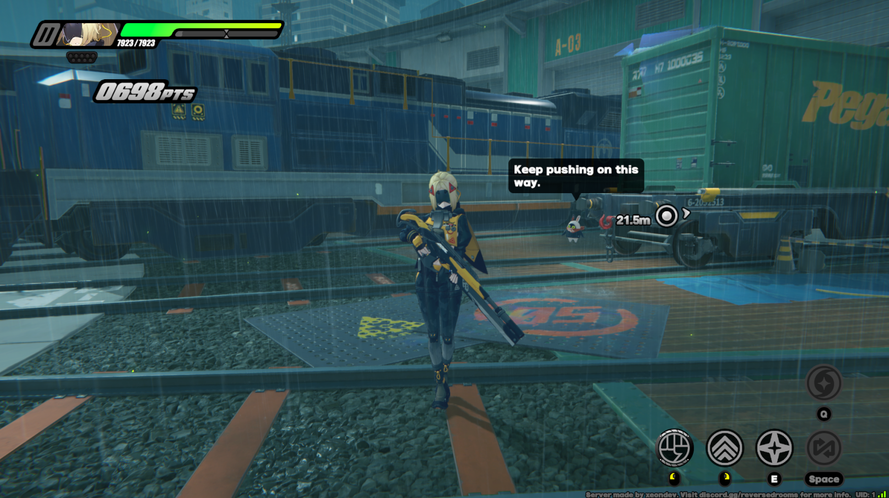

# Trigger-RS

## Introduction
Trigger-RS is a set of servers implemented for the game Zenless Zone Zero.



## Current status
Currently trigger-rs provides these features:
- **Player item management or the inventory**: characters, equipment and currency.
- **Quest management**. Work-in-progress: currently all the quests are unlocked and finished from the beginning and can be replayed using The Archive and Hollow Deep Dive System.
- **Basic battle support**. The server is able to run the combat commissions (including Rally) and the training room.
- **Overworld scene logic**. The server implements the interactions and their systems for overworld (for example: ramen shop, coffee shop and music player)
- **Version-agnostic protocol library**. The server code is not bound to the specific protocol version. Instead, gate-server maps them to standardized structures and uses custom format for internal communication and processing.
- **Server management through MUIP API**.

## Getting started
### Requirements
- [Rust 1.85+](https://www.rust-lang.org/tools/install)
- [PostgreSQL](https://www.postgresql.org/download/)
- [SDK server](https://git.xeondev.com/reversedrooms/hoyo-sdk)
##### NOTE: this server doesn't include the sdk server as it's not specific per game. You can use `hoyo-sdk` with this server.

### Setup
##### a) building from sources
```sh
git clone https://git.xeondev.com/ObolSquad/trigger-rs.git
cd trigger-rs
cargo run --bin trigger-dispatch-server
cargo run --bin trigger-gate-server
cargo run --bin trigger-game-server
cargo run --bin trigger-hall-server
cargo run --bin trigger-battle-server
cargo run --bin trigger-muip-server
```
##### b) using pre-built binaries
Navigate to the [Releases](https://git.xeondev.com/obolsquad/trigger-rs/releases) page and download the latest release for your platform.
Start each service in order from option `a)`.

### Configuration
Most of the configuration (database, encryption keys) is stored in a shared environment configuration file (`environment.toml`). Some of server-specific options are stored in their respective configuration files (which are created upon first startup of each server).

##### Database section
You have to specify credentials for **PostgreSQL**<br>
###### An example of database configuration:
```
[database]
host = "localhost:5432"
user_name = "postgres"
password = ""
db_name = "wicked_waifus_db"
```
##### NOTE: don't forget to create database with specified `db_name` (default: `wicked_waifus_db`). For example, you can do so with PgAdmin.

### Logging in
To login to this server, you have to obtain a compatible game client. Currently supported one is `CNBetaWin1.6.0`, you can [get it here](https://git.xeondev.com/xeon/3/raw/branch/3/nap_beta_1.6_reversedrooms.torrent). Next, you have to apply the necessary [client patch](https://git.xeondev.com/ObolSquad/trigger-patch). It allows you to connect to the local server and replaces encryption keys with custom ones.

### Management
You can use the [trigger-muip-tool](https://git.xeondev.com/ObolSquad/trigger-muip-tool) to communicate with MUIP server and execute GM commands.

### Community
[Our Discord Server](https://discord.gg/reversedrooms) is open for everyone who's interested in our projects!

### Support
Your support for this project is greatly appreciated! If you'd like to contribute, feel free to send a tip [via Boosty](https://boosty.to/xeondev/donate)!
